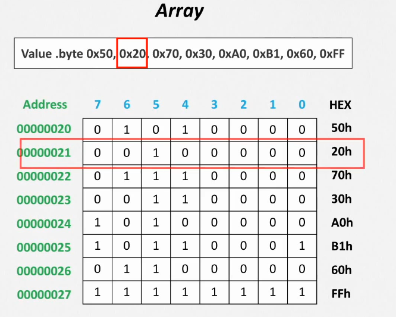

# ASSEMBLER


To actually speak to electronic hardware, you need to send electrical signals. The easiest signals for computers to understand are on and off , and so the computer alphabet is just two letters. Just as the 26 letters of the English alphabet do not limit how much can be written, the two letters of the computer alphabet do not limit what computers can do. Th e two symbols for these two letters are the numbers 0 and 1, and we commonly think of the computer language as numbers in base 2, or binary numbers. We refer to each “letter” as a binary digit or bit. Computers are slaves to our commands, which are called instructions. Instructions, which are just
collections of bits that the computer understands and obeys, can be thought of as numbers. For example, the bits.

1000110010100000

tell one computer to add two numbers. Chapter 2 explains why we use numbers
for instructions and data; we don’t want to steal that chapter’s thunder, but using numbers for both instructions and data is a foundation of computing. The fi rst programmers communicated to computers in binary numbers, but this was so tedious that they quickly invented new notations that were closer to the way humans think. At fi rst, these notations were translated to binary by hand, but this process was still tiresome. Using the computer to help program the computer, the pioneers invented programs to translate from symbolic notation to binary. Th e fi rst of these programs was named an assembler. Th is program translates a symbolic version of an instruction into the binary version. For example, the programmer would write.

add A,B

and the assembler would translate this notation into

1000110010100000

Th is instruction tells the computer to add the two numbers A and B. Th e name coined
for this symbolic language, still used today, is assembly language. In contrast, the
binary language that the machine understands is the machine language.

# PROCESADOR
Un procesador es una calculadora y para hacer esos calculos se almacenan numeros en pequeñas memorias llamadas registros

***HAY DOS TIPOS DE REGISTROS:***
1. Para numeros enteros
2. Para numeros decimales
   


# Flags
1. N Will be enabled (N == 1) if the result of the instruction yields a negative number
and will be disabled (N == 0) otherwise.
2. Z Will be enabled (Z == 1) if the result of the instruction yields a zero value and will
be disabled (Z == 0) if nonzero.
3. C Will be enabled if the result of the instruction is a value that requires a 33rd bit to
be fully represented. For instance an addition that over
ows the 32 bit range of
integers. There is a special case for C and subtractions where a non-borrowing
subtraction enables it, and it is disabled otherwise: subtracting a larger number
from a smaller one enables C, but it will be disabled if the subtraction is done in
the other order.
4. V Will be enabled if the result of the instruction yields a value that cannot be repre-
sented in 32 bit two's complement form and will be disabled otherwise.

# Banderas

1. N Se habilitará (N == 1) si el resultado de la instrucción arroja un número negativo y se deshabilitará (N == 0) en caso contrario.
2. Z Se habilitará (Z == 1) si el resultado de la instrucción arroja un valor cero y se deshabilitará (Z == 0) si es distinto de cero.
3. C Se habilitará si el resultado de la instrucción es un valor que requiere un bit 33 para estar completamente representado. Por ejemplo, una adición que sobrepase el rango de 32 bits de
números enteros. Hay un caso especial para C y las restas donde una resta que no es de préstamo la habilita y, en caso contrario, está deshabilitada: restar un número mayor de uno más pequeño habilita C, pero se deshabilitará si la resta se realiza en el otro orden.
4. V Se habilitará si el resultado de la instrucción arroja un valor que no puede ser

# Condicionales

## AND


| x  | y  | x and y |
|----|----|---------|
| 0  | 0  |    0    |
| 0  | 1  |    0    |
| 1  | 0  |    0    |
| 1  | 1  |    1    |

## OR


| x  | y  | x and y |
|----|----|---------|
| 0  | 0  |    0    |
| 0  | 1  |    1    |
| 1  | 0  |    1    |
| 1  | 1  |    1    |

## BIC
La operación bic realiza una operación AND bit a bit entre el primer registro y el complemento del segundo registro. En otras palabras, realiza una operación AND entre el primer registro y la negación del segundo registro.

Si representamos los valores en los registros x0 y x3 como A y B respectivamente, la operación bic se puede representar como A AND NOT B.

Aquí está el desglose paso a paso de la operación bic x4, x0, x3 en tu código:

Entrada: Los valores iniciales en los registros son x0 = 0b10010110 y x3 = 0b10000100.
Negación: Primero, calculamos el complemento (negación) de x3. El complemento de un número binario se obtiene invirtiendo todos sus bits (cambiando los 1s por 0s y viceversa). Entonces, el complemento de x3 es NOT 0b10000100 = 0b01111011.
Operación AND: Luego, realizamos una operación AND bit a bit entre x0 y el complemento de x3. La operación AND devuelve 1 si ambos bits son 1, y 0 en caso contrario. Entonces, x0 AND NOT x3 = 0b10010110 AND 0b01111011 = 0b00010010.
Resultado: Finalmente, almacenamos el resultado en x4. Por lo tanto, después de la operación bic, x4 = 0b00010010.

## EOR


| x  | y  | x and y |
|----|----|---------|
| 0  | 0  |    0    |
| 0  | 1  |    1    |
| 1  | 0  |    1    |
| 1  | 1  |    0    |

## NOT

La instrucción lsl #48 en el código es una operación de desplazamiento lógico a la izquierda (Logical Shift Left) por 48 bits.

En la instrucción movn x3, #0x8000, lsl #48, el valor inmediato 0x8000 se desplaza a la izquierda por 48 bits antes de calcular el complemento para la operación movn.

Esto se hace generalmente para mover un valor a una posición específica en un registro de 64 bits. En este caso, el valor 0x8000 se está moviendo a las posiciones de bit más altas del registro x3

## BRANCHING
Until now our small assembler programs execute one instruction after the other. If our
ARM processor were only able to run this way it would be of limited use. It could not
react to existing conditions which may require diferent sequences of instructions. That
is the purpose of the branch instructions.

## Unconditional branches
You can tell the processor to branch unconditionally by using the instruction b (for
Branch) and a label. Consider the following program.

```s
/* -- branch01.s */
.text
.global main
main:
    mov r0, #2 @ r0 <- 2
    b end @ branch to 'end'
    mov r0, #3 @ r0 <- 3
end:
    bx lr
```
If you execute this program you will see that it returns an error code of 2.

$ ./branch01 ; echo $?
2

What happened is that instruction b end branched (modifying the pc register) to the
instruction at the label end, which is bx lr, the instruction we execute at the end of
our program. This way the instruction mov r0, #3 was not actually executed at all
(the processor jumped over that instruction).

At this point the unconditional branch instruction b may look a bit useless but that is not the case. In fact this instruction is essential in some contexts; in particular, when linked with conditional branching. But before we can talk about conditional branching
we need to talk about conditions.

## conditional branches

If our processor were only able to branch when we put the unconditional branch b in
our program, it would not be very useful. It is much more useful to branch when some
condition is met. So a processor should be able to evaluate some sort of conditions.

If our processor were only able to branch when we put the unconditional branch b in
our program, it would not be very useful. It is much more useful to branch when some
condition is met. So a processor should be able to evaluate some sort of conditions.

Before continuing, we need to unveil another register called the cpsr (for Current Pro-
gram Status Register). This register is a bit special and directly modifying it is out of
the scope of this chapter. That said, it keeps some values that can be read and updated
when executing an instruction. The contents of that register include four condition code
bits, called  ags, named N (Negative), Z (Zero), C (Carry) and V (oVer
ow).


## Conditional Strcture
They are really powerful tools because they allow us to express control structures. Structured programming is an important milestone in better computing engineering so being able to map all
the usual structured programming constructs in assembler, in our processor.

## If, then, else
This is one of the most basic control structures. In fact, we already used this structure
in the previous chapter. Consider the following structure, where E is an expression and
S1 and S2 are statements (they may be compound statements like f SA; SB; SC; g).

if (E) then
    S1
else
    S2

A possible way to express this in ARM assembler could be the following

if_eval:
    /* Assembler that evaluates E and updates the cpsr accordingly */
bXX else_part /* Here XX is the appropriate condition */
then_part:
    /* assembler code for S1, the "then" part */
    b end_of_if
else_part:
    /* assembler code for S2, the "else" part */
end_of_if:

If there is no else part statement, we can replace bXX else part with bYY end of if
and omit the b end of if and the next two lines.

## Loops
This is another basic control structure in structured programming. While there are
several types of loops, actually all can be reduced to the following structure.

while (E)
    S

Supposedly S executes some instructions so than E eventually becomes false and the
loop is left. Otherwise we would stay in the loop forever (sometimes this is what you
want but not in our examples). A way to implement these loops is as follows.

while_condition:
    /* assembler code to evaluate E and update cpsr */
    bXX end_of_loop /* If E is false, leave the loop right now */
    /* assembler code for the statement S */
    b while_condition /* Unconditional branch to the beginning */
end_of_loop:

A common loop involves iterating over a single range of integers, as in

for (i = L; i < N; i += K)
    S
But this is nothing but
i = L;
while (i < N)
{
    S;
    i += K;
}

So we do not have to learn a new way to implement the loop itself.

## Arrays and structures



In the previous chapter we saw that the second source operand of most arithmetic
instructions can use a shift operator which allows us to shift and rotate bits. In this
chapter we will learn about additional indexing modes available to ARM instructions.
This time we will focus on load and store instructions.

So far we have been able to move 32 bits from memory to registers (load) and back to
memory (store). But working on single items of 32 bits (usually called scalars) is a bit
limiting. Soon we would end ourselves working on arrays and structures, even if we did
not know their names.

An array is a sequence of items of the same kind in memory. Arrays are a fundamental
data structure in almost every low level language. Every array has a base address,
usually denoted by the name of the array. Each of its items has associated with it an
index, usually ranging from 0 to N 􀀀1 when the array contains N items. Using the base
address and the index we can access an item of the array. We mentioned in Chapter 3
that memory could be viewed as an array of bytes. An array in memory is the same,
except an item may take more than one single byte.

A structure (or record or tuple) is a sequence of items of possibly diferent kinds. Each item of a structure is usually called a feld. Fields do not have an associated index
but an ofset with respect to the beginning of the structure. Structures are laid out in
memory in an array that ensures that the proper alignment is used in every feld. The
base address of a structure is the address of its frst feld. If the base address is aligned,
the structure should be laid out in a way that all the feld are properly aligned as well.

What do arrays and structure have to do with indexing modes of load and store? Well,
these indexing modes are designed to make accessing arrays and structures easier.